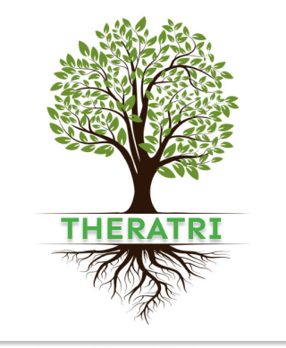
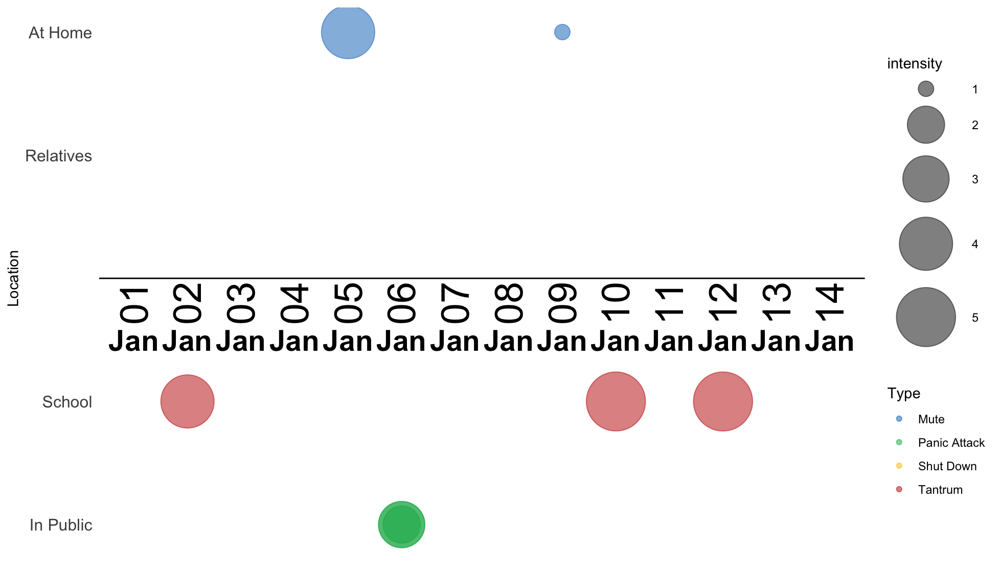

```{r logo, echo=FALSE, out.width="10%", out.extra='style="float:right; padding:10px"'}

```


**Child Check-In Key Points:**

- Mentioned scared 8 times (up 33%)
- Talked about “teacher” 14 times (down 1%)
- Attempted breathing exercises 2 times (up 100%) 
- Scared was co-mentioned with “teacher” 7 times
```{r am, echo=FALSE, out.width="10%",out.extra='style="float:right; padding:10px"'}
knitr::include_graphics(c("am.png","pm.png"))
```


## Highest Intensity Events as Reported by Parents:
- “Johnny had a tantrum right off the bus ... I told him he needs to go to school or cannot play Minecraft.
- “We were doing homework when hegot angry...we gave up.”

```{r timeline, echo =FALSE, out.width="25%"}

```
